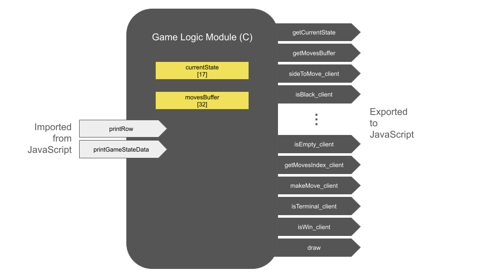
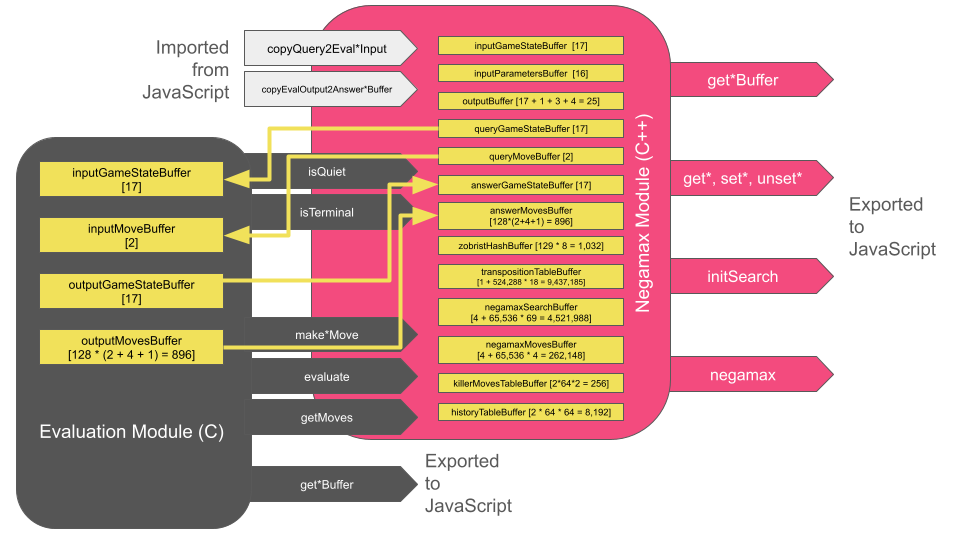

# [Lines of Action](https://www.ericjoycefilm.com/wastesoftime/boardgames/linesofaction/index.php?lang=en)
Notes on the creation of Lines of Action

## Docker container to compile C to WebAssembly
Create the container.
```
sudo docker build -t c-wasm .
```

Confirm its existence.
```
sudo docker images
```

Kill the container.
```
sudo docker image rm c-wasm
```

## Zobrist hash generator
This executable (not a WebAssembly module) lives on the server back-end. Compile using GCC. Call it when the page loads to generate a random Zobrist hash for every game.
```
gcc -Wall zgenerate.c -lm -o zgenerate
```

## Opening-book Zobrist hasher
Unlike the in-game hasher, this one is *not* randomly generated for each session.

This executable (not a WebAssembly module) lives on the server back-end. Compile using GCC. Call it from the PHP lookup script.
```
g++ -Wall hash.cpp -lm -o hash
```

For example:
```
./hash 126 0 0 0 0 0 0 126 0 129 129 129 129 129 129 0 128
```

should produce
```
5317689825764910829
```

To look this position up in the opening book, call:
```
./lookup 5317689825764910829 126 0 0 0 0 0 0 126 0 129 129 129 129 129 129 0 128
```

which produces, for example,
```
SUCCESS,3,17
```

which is the one of four moves on file for this state.

## Constants for the game engine

| Name  | Bytes  | Description |
| :---:	| :----: | :---------: |
| _GAMESTATE_BYTE_SIZE | 17 | Number of bytes needed to encode a game state |
| _MOVE_BYTE_SIZE | 2 | Number of bytes needed to describe a move in Lines of Action |
| _MAX_NUM_TARGETS | 32 | A (generous) upper bound on how many distinct destinations (not distinct moves) may be available to a player from a single index |
| _MAX_MOVES | 128 | A (generous) upper bound on how many moves may be made by a team in a single turn |
| _PARAMETER_ARRAY_SIZE | 16 | Encodes values that are written to and read from the the search process |
| _KILLER_MOVE_PER_PLY | 2 | Chess engines typically store 2 killer moves per ply |
| _KILLER_MOVE_MAX_DEPTH | 64 | Not to say that we actually search to depth 64! This is just comfortably large. |
| _TRANSPO_RECORD_BYTE_SIZE | 17 | Number of bytes needed to store a TranspoRecord object |
| _TRANSPO_TABLE_SIZE | 524288 | Number of TranspoRecords, each 18 bytes |
| _TREE_SEARCH_ARRAY_SIZE | 65536 | Number of (game-state bytes, move-bytes) |
| _NEGAMAX_NODE_BYTE_SIZE | 69 | Number of bytes needed to encode a negamax node |
| _NEGAMAX_MOVE_BYTE_SIZE | 3 | Number of bytes needed to encode a negamax move (in their separate, global array) |
| ZHASH_TABLE_SIZE | 129 | Number of Zobrist keys |
| _BLACK_TO_MOVE | 0 | Indication that black is to move in the current game state |
| _WHITE_TO_MOVE | 1 | Indication that white is to move in the current game state |

## Client-facing game logic module

### Game-Logic Module



The **game-logic module** has *two* outward-facing buffers:
- `currentState` is `_GAMESTATE_BYTE_SIZE` bytes long. It encodes the current state of the game.
- `movesBuffer` is `_MAX_NUM_TARGETS` bytes long.

Compile the front-end, client-facing game-logic module. This WebAssembly module answers queries from the client-side like getting data about which pieces can move where.
```
sudo docker run --rm -v $(pwd):/src -u $(id -u):$(id -g) --mount type=bind,source=$(pwd),target=/home/src c-wasm emcc -Os -s STANDALONE_WASM -s EXPORTED_FUNCTIONS="['_getCurrentState','_getMovesBuffer','_sideToMove_client','_isBlack_client','_isWhite_client','_isEmpty_client','_getMovesIndex_client','_makeMove_client','_isTerminal_client','_isWin_client','_draw']" -Wl,--no-entry "gamelogic.c" -o "gamelogic.wasm"
```

This produces a `.wasm` with callable functions.

The first two simply fetch the memory addresses of this module's buffers:
- `gameEngine.instance.exports.getCurrentState();` returns the address of the game-logic module's current-gamestate buffer.
- `gameEngine.instance.exports.getMovesBuffer();` returns the address of the game-logic module's move-targets buffer.

The other module functions are as follows:
- `gameEngine.instance.exports.sideToMove_client();` returns `_BLACK_TO_MOVE` or `_WHITE_TO_MOVE`.
- `gameEngine.instance.exports.isBlack_client(unsigned char);` returns a Boolean value indicating whether the piece at the given index belongs to the black team.
- `gameEngine.instance.exports.isWhite_client(unsigned char);` returns a Boolean value indicating whether the piece at the given index belongs to the white team.
- `gameEngine.instance.exports.isEmpty_client(unsigned char);` returns a Boolean value indicating whether the given index is empty.
- `gameEngine.instance.exports.getMovesIndex_client(unsigned char);` returns the number of legal targets `n` as an unsigned int and writes a run of `n` indices to the move-targets buffer.
- `gameEngine.instance.exports.makeMove_client(unsigned char, unsigned char, unsigned char);` applies the given move to the current game state and overwrites its encoding in the `currentState` buffer.
- `gameEngine.instance.exports.isTerminal_client();` returns a Boolean value indicating whether the current game state is terminal.
- `gameEngine.instance.exports.isWin_client();` returns an unsigned char indicating whether white has won, black has won, the game has reached stalemate, or the game is ongoing.
- `gameEngine.instance.exports.draw();` prints the board to the browser console.

## The negamax heartbeat
For our deployment to a web page, tree-search has to become a **stack-based, continuation-passing, finite state machine**. The web page is single-threaded, so if we try to run search all at once, the rest of the page freezes. I’ve rewritten the usual recursive negamax as an explicit-stack DFS where each node carries a phase (program counter). Each "heartbeat" executes one small slice of work for the node at the top of the stack, updates the node’s phase/bookmarks, and returns control to the browser. In other words, it’s recursion turned into a continuation (resume point) stored in data. The advantages of this are that it doesn't freeze the browser, and it allows search to occur at any time, even during the human player's turn.

## Negamax & evaluation engines
I have separated game logic and node evaluation from tree-search. This allows me to have a single, game-agnostic negamax engine (in C++) for any two-player, non-stochastic, perfect-information game, while I write particular game logic and evaluation in whichever language I choose. (This work is for fun and exercise, and I am deliberately cultivating a variety of programming languages across projects.) The JavaScript class `player.js` glues together and coordinates these components.



### Evaluation Module

The **evaluation module** has *four* outward-facing buffers:
- `inputGameStateBuffer` is `_GAMESTATE_BYTE_SIZE` bytes long. The negamax module writes bytes here and can then ask the evaluation module things like, "What moves are available from this state?"
- `inputMoveBuffer` is `_MOVE_BYTE_SIZE` bytes long. The negamax module writes bytes here and writes game-state bytes to `inputGameStateBuffer` and can then ask, "What game state results from making this move from this state?"
- `outputGameStateBuffer` is `_GAMESTATE_BYTE_SIZE` bytes long and encodes a chess state after an operation. The negamax module reads these bytes from the evaluation module.
- `outputMovesBuffer` is `_MAX_MOVES` * (`_MOVE_BYTE_SIZE` + 4 + 1) bytes long. Each set of (`_MOVE_BYTE_SIZE` + 4 + 1) bytes encode the move (`_MOVE_BYTE_SIZE`), the rough score (4) computed using SEE, promotions, and checks, and a flag (1) indicating whether the move is "quiet"--meaning neither a capture nor a promotion. The negamax module reads these, updates their scores for better move-ordering, and turns them into search nodes. The "quiet" flag is also used laster to update killer moves and the history heuristic. Note that we do *not* encode the number of moves in the buffer using the first 4 bytes: rather, the number of moves is the value returned by this function.

Compile the evaluation module:
```
sudo docker run --rm -v $(pwd):/src -u $(id -u):$(id -g) --mount type=bind,source=$(pwd),target=/home/src c-wasm emcc -Os -s STANDALONE_WASM -s EXPORTED_FUNCTIONS="['_getInputGameStateBuffer','_getInputMoveBuffer','_getOutputGameStateBuffer','_getOutputMovesBuffer','_sideToMove_eval','_isTerminal_eval','_makeMove_eval','_makeNullMove_eval','_evaluate_eval','_getMoves_eval']" -Wl,--no-entry "gropius.c" -o "eval.wasm"
```
This produces a `.wasm` with functions you can load into the JavaScript Player class and call.

The first four simply fetch the memory addresses of this module's buffers:
- `this.evaluationEngine.instance.exports.getInputGameStateBuffer();` returns the address of the evaluation module's input-gamestate buffer.
- `this.evaluationEngine.instance.exports.getInputMoveBuffer();` returns the address of the evaluation module's input-move buffer.
- `this.evaluationEngine.instance.exports.getOutputGameStateBuffer();` returns the address of the evaluation module's output-gamestate buffer.
- `this.evaluationEngine.instance.exports.getOutputMovesBuffer();` returns the address of the evaluation module's output-moves buffer.

The other module functions are as follows:
- `this.evaluationEngine.instance.exports.sideToMove_eval();` returns `_BLACK_TO_MOVE` or `_WHITE_TO_MOVE`.
- `this.evaluationEngine.instance.exports.isTerminal_eval();` returns a Boolean value, according to the game state bytes previously written to the evaluation module's input-gamestate buffer.
- `this.evaluationEngine.instance.exports.makeMove_eval();` decodes and applies the move stored in `inputMoveBuffer` to the decoded game state stored in `inputGameStateBuffer`, and writes the encoded, resultant game state in `outputGameStateBuffer`.
- `this.evaluationEngine.instance.exports.makeNullMove_eval();` decodes the game state stored in `inputGameStateBuffer`, applies a null-move, and writes the encoded, resultant game state in `outputGameStateBuffer`.
- `this.evaluationEngine.instance.exports.evaluate_eval();` evaluates the query game state from the point of view of its side to move.
- `this.evaluationEngine.instance.exports.getMoves_eval();` write all moves available to the query game state's side to move, sorted descending by "interestingness". This is a fast-and-cheap heuristic intended to generate cut-offs.

### Negamax Module

The **negamax module** has *thirteen* outward-facing buffers:
- `inputGameStateBuffer` is `_GAMESTATE_BYTE_SIZE` bytes long. It encodes a game state to be treated as the root node in negamax search.
- `inputParametersBuffer` is `_PARAMETER_ARRAY_SIZE` bytes long. It encodes a negamax search's ID, status, control flags, target depth, depth achieved, deadline in milliseconds (if applicable), and number of nodes evaluated.
- `outputBuffer` is `_GAMESTATE_BYTE_SIZE` + 1 + `_MOVE_BYTE_SIZE` + 4 bytes long. It encodes the results of negamax search. See below.
- `queryGameStateBuffer` is `_GAMESTATE_BYTE_SIZE` bytes long. The negamax module writes a game state encoding here, and the JavaScript Player class copies these bytes to the evaluation module's input-game-state buffer.
- `queryMoveBuffer` is `_MOVE_BYTE_SIZE` bytes long. The negamax module writes a move encoding here, and the JavaScript Player class copies these bytes to the evaluation module's input-move buffer.
- `answerGameStateBuffer` is `_GAMESTATE_BYTE_SIZE` bytes long. The evaluation module writes an encoded, resultant game state to its output-game-state buffer, and the JavaScript Player class copies these bytes here. 
- `answerMovesBuffer` is `_MAX_MOVES` * (`_MOVE_BYTE_SIZE` + 4 + 1) bytes long. It encodes moves, rough scores (4-byte signed int) to be used for move ordering, and a 1-byte flag indicating whether the move is "quiet", here meaning "neither a capture nor a promotion".
- `zobristHashBuffer` is `ZHASH_TABLE_SIZE` * 8 bytes long. Eight bytes is the size of an unsigned long long.
- `transpositionTableBuffer` is 1 + `_TRANSPO_TABLE_SIZE` * `_TRANSPO_RECORD_BYTE_SIZE` bytes long. The first byte encodes the current "generation" for new records.
- `negamaxSearchBuffer` is 4 + `_TREE_SEARCH_ARRAY_SIZE` * `_NEGAMAX_NODE_BYTE_SIZE` bytes long.
- `negamaxMovesBuffer` is 4 + `_TREE_SEARCH_ARRAY_SIZE` * `_NEGAMAX_MOVE_BYTE_SIZE` bytes long.
- `killerMovesTableBuffer` is `_KILLER_MOVE_PER_PLY` * 2 * `_KILLER_MOVE_MAX_DEPTH` bytes long.
- `historyTableBuffer` is 2 * 64 * 64 bytes long.

Compile the negamax module:
```
sudo docker run --rm -v $(pwd):/src -u $(id -u):$(id -g) --mount type=bind,source=$(pwd),target=/home/src c-wasm em++ -I ./ -Os -s STANDALONE_WASM -s INITIAL_MEMORY=17104896 -s STACK_SIZE=1048576 -s EXPORTED_FUNCTIONS="['_getMaxPly','_getInputBuffer','_getParametersBuffer','_getQueryGameStateBuffer','_getQueryMoveBuffer','_getAnswerGameStateBuffer','_getAnswerMovesBuffer','_getOutputBuffer','_getZobristHashBuffer','_getTranspositionTableBuffer','_getNegamaxSearchBuffer','_getNegamaxMovesBuffer','_getKillerMovesBuffer','_getHistoryTableBuffer','_setSearchId','_getSearchId','_getStatus','_setControlFlag','_unsetControlFlag','_getControlByte','_setTargetDepth','_getTargetDepth','_getDepthAchieved','_setDeadline','_getDeadline','_resetNodesSearched','_getNodesSearched','_finalDepthAchieved','_finalScore','_getNodeStackSize','_getMovesArenaSize','_initSearch','_negamax']" -Wl,--no-entry "negamax.cpp" -o "negamax.wasm"
```
This produces a `.wasm` with functions you can load into the JavaScript Player class and call.

The following are simply buffer-retrieval functions used by the Player class to wire the WebAssembly module to JavaScript byte arrays.
- `this.negamaxEngine.instance.exports.getInputBuffer();` returns the address of the negamax module's input-gamestate buffer.
- `this.negamaxEngine.instance.exports.getParametersBuffer();` returns the address of the negamax module's parameters buffer.
- `this.negamaxEngine.instance.exports.getQueryGameStateBuffer();` returns the address of the negamax module's query gamestate buffer.
- `this.negamaxEngine.instance.exports.getQueryMoveBuffer();` returns the address of the negamax module's query move buffer.
- `this.negamaxEngine.instance.exports.getAnswerGameStateBuffer();` returns the address of the negamax module's answer gamestate buffer.
- `this.negamaxEngine.instance.exports.getAnswerMovesBuffer();` returns the address of the negamax module's answer moves buffer.
- `this.negamaxEngine.instance.exports.getOutputBuffer();` returns the address of the negamax module's output buffer.
- `this.negamaxEngine.instance.exports.getZobristHashBuffer();` returns the address of the negamax module's Zobrist hash buffer.
- `this.negamaxEngine.instance.exports.getTranspositionTableBuffer();` returns the address of the negamax module's transposition-table buffer.
- `this.negamaxEngine.instance.exports.getNegamaxSearchBuffer();` returns the address of the negamax module's negamax search buffer.
- `this.negamaxEngine.instance.exports.getNegamaxMovesBuffer();` returns the address of the negamax module's negamax moves buffer.
- `this.negamaxEngine.instance.exports.getKillerMovesBuffer();` returns the address of the negamax module's killer moves buffer.
- `this.negamaxEngine.instance.exports.getHistoryTableBuffer();` returns the address of the negamax module's history heuristic buffer.

The following functios are used to control and monitor tree-search.
- `this.negamaxEngine.instance.exports.getMaxPly();` returns an unsigned char.
- `this.negamaxEngine.instance.exports.setSearchId(unsigned int);`
- `this.negamaxEngine.instance.exports.getSearchId();` returns an unsigned int.
- `this.negamaxEngine.instance.exports.getStatus();` returns an unsigned char.
- `this.negamaxEngine.instance.exports.setControlFlag(unsigned char);`
- `this.negamaxEngine.instance.exports.unsetControlFlag(unsigned char);`
- `this.negamaxEngine.instance.exports.getControlByte();` returns an unsigned char.
- `this.negamaxEngine.instance.exports.setTargetDepth(unsigned char);`
- `this.negamaxEngine.instance.exports.getTargetDepth();` returns an unsigned char.
- `this.negamaxEngine.instance.exports.getDepthAchieved();` returns an unsigned char.
- `this.negamaxEngine.instance.exports.setDeadline(unsigned int);`
- `this.negamaxEngine.instance.exports.getDeadline();` returns an unsigned int.
- `this.negamaxEngine.instance.exports.resetNodesSearched();` returns nothing.
- `this.negamaxEngine.instance.exports.getNodesSearched();` returns an unsigned int.
- `this.negamaxEngine.instance.exports.finalDepthAchieved();` returns an unsigned char.
- `this.negamaxEngine.instance.exports.finalScore();` returns a float.
- `this.negamaxEngine.instance.exports.getNodeStackSize();` returns an unsigned int.
- `this.negamaxEngine.instance.exports.getMovesArenaSize();` returns an unsigned int.

Especially important:
- `this.negamaxEngine.instance.exports.initSearch();` returns nothing.
- `this.negamaxEngine.instance.exports.negamax();` returns a bool.

## Citation
If this code was helpful to you, please cite this repository.

```
@misc{linesofaction,
  title={Lines of Action in C},
  author={Eric C. Joyce},
  year={2025},
  publisher={Github},
  journal={GitHub repository},
  howpublished={\url{https://github.com/EricCJoyce/Lines-of-Action}}
}
```
